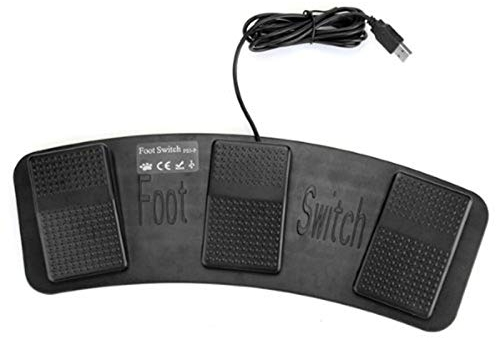

### How to set 「FS3-P USB Triple Foot Switch Pedal Control」 in linux

#### Install dependency packages
```swift
sudo apt-get install libudev-dev libusb-1.0-0-dev libfox-1.6-dev libhidapi-dev
```
```swift
git clone https://github.com/rgerganov/footswitch.git
```
```swift
cd footswitch && make && sudo make install 
```
***
#### How to usage
[Usage link](https://github.com/rgerganov/footswitch#usage)
***
#### My foot switch setting 
```swift
footswitch -1 -k esc -2 -a esc -a : -a w -a q -a enter -3 -a esc -a : -a w -a enter
```
|Left Key|Center Key|Right Key|
|:---:|:---:|:---:|
|Esc|Esc : wq|Esc : w enter|

왼&nbsp;&nbsp;&nbsp;쪽 : Esc  
가운데 : Vim 저장하고 나가기  
오른쪽 : Vim 파일 저장하기
***
##### Reference  
* [footswitch github](https://github.com/rgerganov/footswitch)  
* [HIDAPI library](https://qbicz.github.io/hidapi/)
